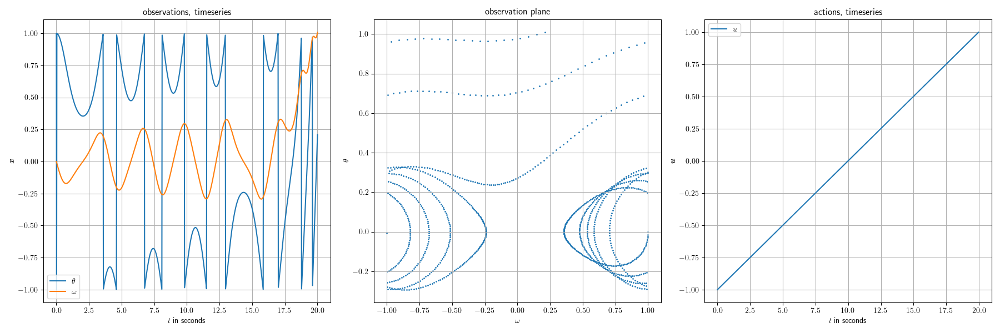

# exciting-environments

## Overview
The exctiting-environments package is a toolbox for the simulation of physical [differential equations](https://en.wikipedia.org/wiki/Differential_equation) wrapped into [Gymnasium](https://github.com/Farama-Foundation/Gymnasium) environments using [Jax](https://github.com/google/jax). Due to the possible just-in-time compilation of JAX, this type of implementation offers great advantages in terms of simulation speed.

## Getting Started

A basic routine is as simple as:
```py
import jax.numpy as jnp
import exciting_environments as excenvs

env = excenvs.make("Pendulum-v0", batch_size=5, action_constraints={"torque": 15}, tau=2e-2) 
obs, state = env.reset()

actions = jnp.linspace(start=-1, stop=1, num=1000)[None, :, None]
actions = actions.repeat(env.batch_size, axis=0)

observations = []
observations.append(obs)

for idx in range(actions.shape[1]):
    obs, reward, terminated, truncated, state = env.vmap_step(
        state, actions[:, idx, :]
    )
    observations.append(obs)
observations = jnp.stack(observations, axis=1)

print("actions shape:", actions.shape)
print("observations shape:", observations.shape)
```

which produces $5$ identical trajectories in parallel:

